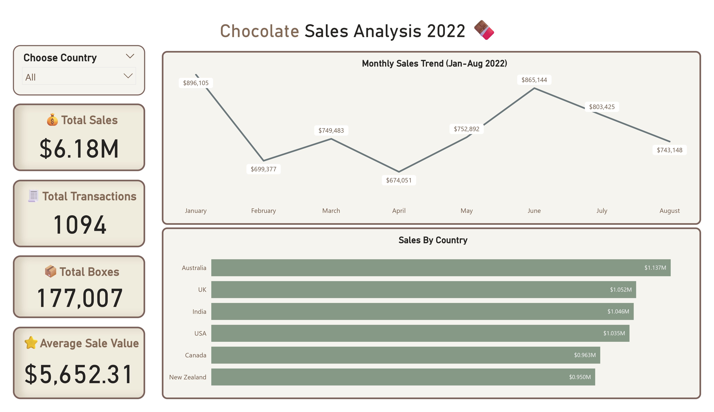
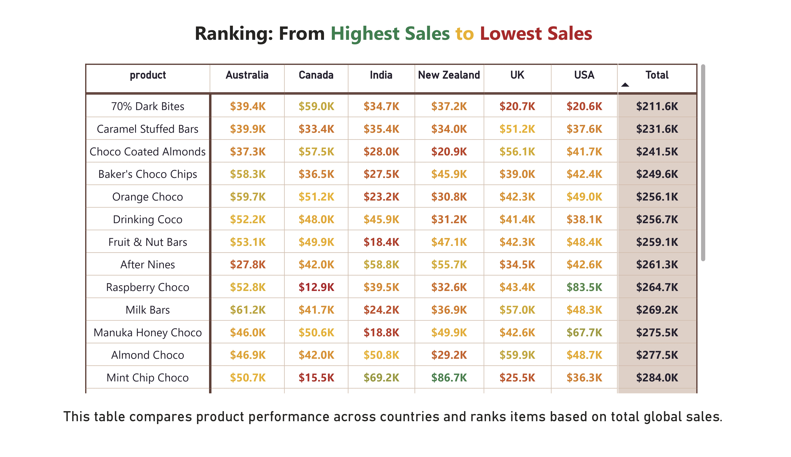

# 🍫 Chocolate Sales BI Project

A comprehensive end-to-end Business Intelligence project analyzing chocolate sales data.
Includes a complete ETL pipeline using Python/Pandas, PostgreSQL data modeling, SQL views, and DAX measures inside an interactive Power BI dashboard designed to uncover  
sales trends, track KPIs, and extract actionable insights.

## 📂 Repository Structure

Here is a quick guide to the files in this repository:

* **`dashboard/`**: Contains the final **Power BI file (.pbix)**. You can open this to explore the interactive report.
* **`etl/`**: Contains the **Python scripts** used for data cleaning and the **SQL queries** used for creating the analytical views.
* **`outputs/`**: High-resolution **screenshots** and the **PDF export** of the dashboard.
* **`data/`**: Contains the raw and processed datasets.

## 🚀 What’s included
- **Overview page:** KPIs (Total Sales, Transactions, Boxes, Avg Sale Value), monthly trend, sales by country  
- **Product Analysis:** Top 10 by revenue & Top 10 by popularity
- **Team Performance:** Team ranking, performance bands, average reference line  
- **Global Comparison:** Product × Country matrix, ranked by total sales

## 🛠 ETL Pipeline 
This project simulates a real-world BI workflow:

### **1️⃣ Extract**
Raw CSV files (`data/raw/`) are imported into a Python environment.

### **2️⃣ Transform (Python/Pandas)**
Data is cleaned and standardized using a Jupyter Notebook:
* Normalizing column names and data types.
* Parsing dates and handling formats.
* Handling missing or inconsistent records.

### **3️⃣ Load (PostgreSQL)**
Cleaned datasets are loaded into a local PostgreSQL database using **SQLAlchemy**.

### **4️⃣ SQL Modeling**
Instead of loading raw tables, **SQL Views** were created to handle aggregation and ranking logic on the database side.

### **5️⃣ Visualization (Power BI)**
A complete 4-page interactive dashboard built on the processed data, featuring custom UI design and DAX logic.
It includes KPIs, trend analysis, product insights, team performance, and global comparisons.

## 🖼️ Dashboard Gallery

### **1. Executive Overview**
*Interactive KPIs and sales trends with a custom sidebar navigation.*

### **2. Product Analysis**
*Comparing "Revenue Heroes" (Profitability) vs. "Fan Favorites" (Volume).*

### **3. Team Performance Leaderboard**
*Dynamic ranking using DAX conditional formatting (Green/Red logic) to spot top performers.*

### **4. Global Matrix (Heatmap)**
*Deep-dive heatmap analyzing product sales across all regions.*

## 🚀 Conclusion & Business Impact

This project successfully transformed raw, scattered sales data into a centralized and automated Business Intelligence solution. By replacing manual reporting with this interactive pipeline, several key business values were realized:

1.  **Data-Driven Decision Making:**
    * The **"Revenue vs. Volume" analysis** (Page 2) exposed that high-volume products aren't always the most profitable, allowing management to adjust pricing or marketing strategies for under-monetized "Fan Favorites."

2.  **Performance Optimization:**
    * The **"Traffic Light" logic** (Page 3) eliminated guesswork in employee evaluation. Managers can now instantly identify top performers for retention and low performers for coaching, based on dynamic, unbiased data.

3.  **Operational Efficiency:**
    * Moving from static CSV files to a **PostgreSQL + Power BI** workflow ensures that data is always consistent, scalable, and ready for analysis without repetitive manual cleaning.

*Thank you for exploring this data journey!*
